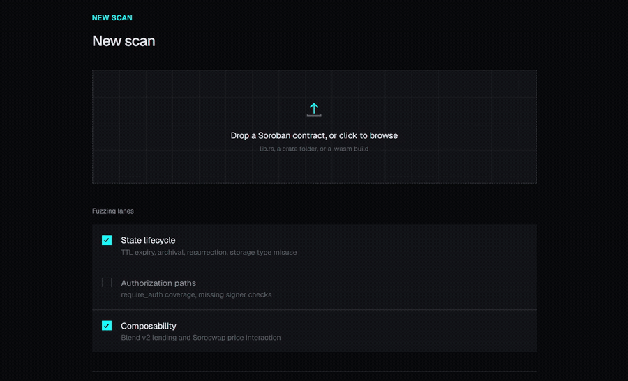
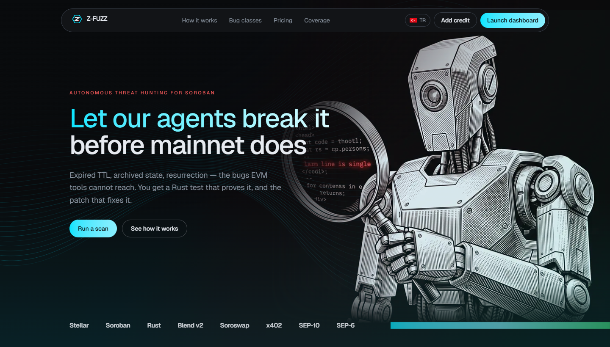
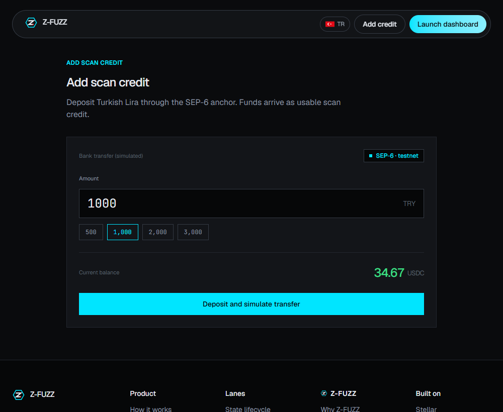
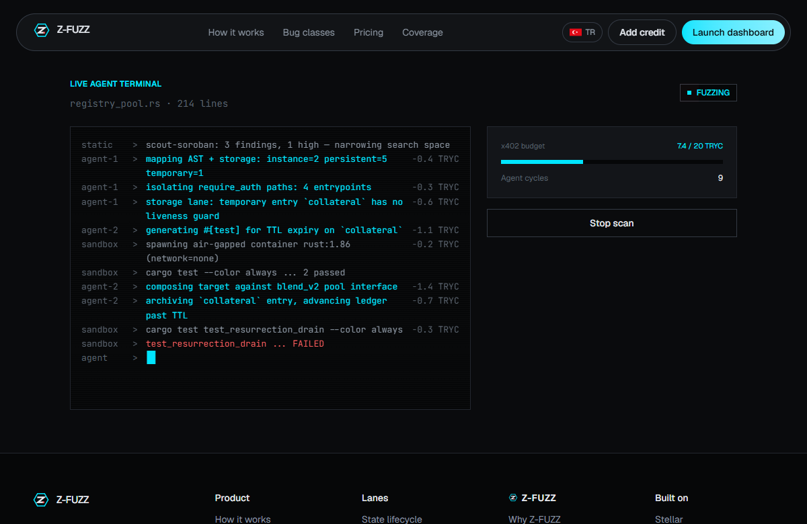
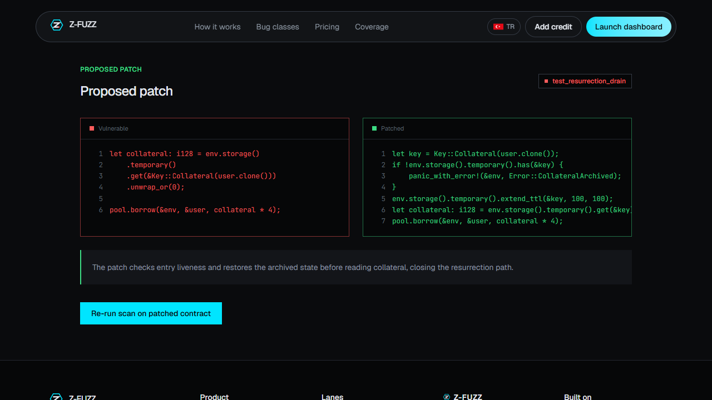
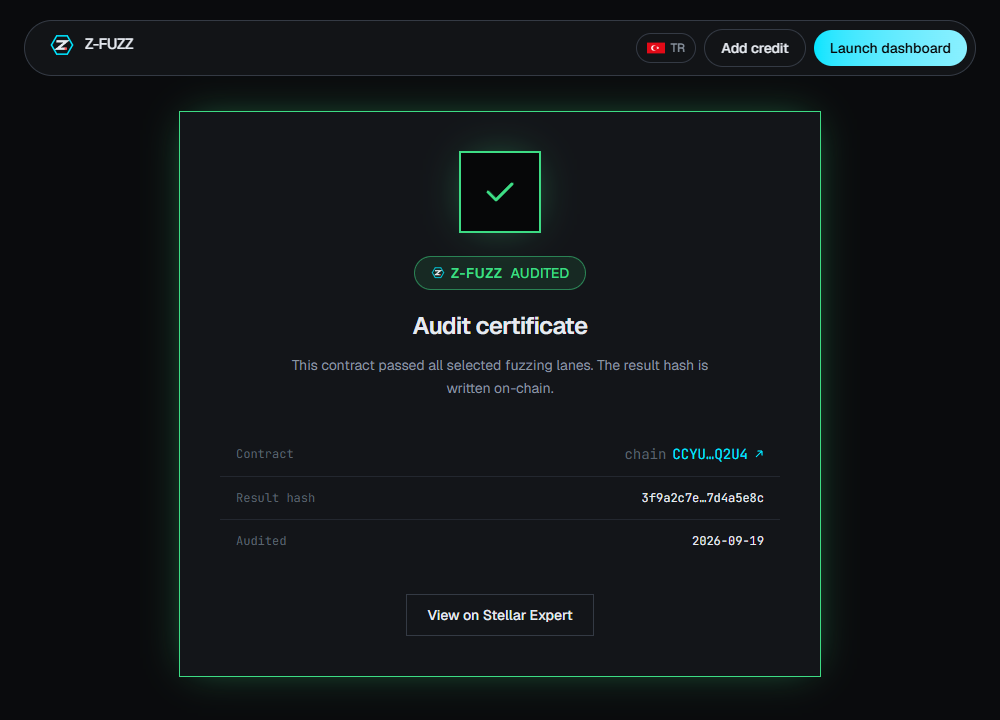
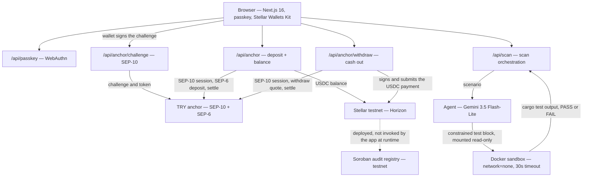

<p align="center">
  
</p>

<p align="center"><b>Let our agents break your contract before mainnet does.</b></p>

<p align="center">
  <a href="https://zero-fuzz-risein1.vercel.app"><b>Live app</b></a> ·
  <a href="docs/demo/zero-fuzz-demo.mp4"><b>Demo video</b></a> ·
  <a href="https://stellar.expert/explorer/testnet/contract/CANPTYOSSNRLY65FHFK5M4XFDZKSNRF36FMRSB3LGCHTV5F25K7JI6DZ"><b>Contract on testnet</b></a>
</p>

<p align="center">Rise In x Stellar Pro Hackathon, Istanbul · <b>Genesis track</b></p>

---

## What Z-FUZZ is

An autonomous security auditor for Soroban smart contracts.

You fund a scan with Turkish lira through a SEP-6 anchor, hand it a contract, and an agent
spends that credit trying to break it. What comes back is not a report. It is a Rust test
that compiled and failed against your contract, the patch that makes it pass, and an audit
record written to a Soroban registry anyone can read back on chain.





**Demo video:** [`docs/demo/zero-fuzz-demo.mp4`](docs/demo/zero-fuzz-demo.mp4) — 1:26, narrated
and subtitled. A wallet connects, the SEP-10 challenge is signed in Freighter, a scan runs,
and the contract fails inside the sandbox.

---

## The problem

Soroban has a state model the EVM never had. Entries carry a **time-to-live**. When it
lapses the entry is **archived** — unreadable, but not gone. It can later be **restored**,
and a contract that reads it without checking liveness gets a value that looks fine and is
months stale.

Foundry, Echidna and Medusa cannot model any of this. Not because they are weak, but
because on the EVM there is nothing to model: no TTL, no archival, no resurrection, no
choice between instance, persistent and temporary storage. Every Soroban-specific failure
mode falls outside what the mature tooling can even express.

And the expensive failures are not in one contract. They appear under **composition**:

> On 22 February 2026 a YieldBlox DAO pool on Blend V2 priced collateral from a VWAP oracle
> reading an illiquid market. One trade moved the price from about \$1 to \$106 and the pool
> was drained of more than **\$10M**. Blend V2's core contracts were not at fault. The
> configuration was wrong in company.

Manual audits catch this class. They also start around \$8,000 and take weeks, which is why
most contracts reach mainnet having had neither.

**Who this is for.** Soroban teams shipping without an audit budget — the long tail of
hackathon projects, SCF grantees and small protocols where \$8,000 is not a line item but a
drained pool is fatal.

---

## Our solution

Three commitments, and everything else follows from them.

**A finding must be a failing test.** The agent is never allowed to report prose. Its output
is constrained to a `#[test]` block, that test is compiled and executed against the real
contract, and a finding exists only if `cargo test` went red. No confidence score, no
severity guess, nothing for a human to triage. The artifact *is* the proof.

**An audit should cost lira, not an invoice.** Free Soroban-aware tools run first and narrow
the search space, then the metered agent works only where something is already suspicious.
The scan is paid for from an anchor balance, per cycle, so the price scales with the work
rather than with a consultant's calendar.

**The answer ships with the fix.** Every finding carries a proposed patch, and a contract
that comes back clean gets an audit record on chain that anyone can verify independently.
Every scan that reaches a verdict writes that verdict to the registry itself — the result
panel links the transaction.

---

## How it works, step by step

### 1 · Fund the scan through the anchor

Turkish lira in, USDC scan credit out, over SEP-10 and SEP-6. Unused credit can be cashed
back out to a bank account the same way. This is the fiat rail, and it is what pays for the
compute in the next steps.



### 2 · Triage, then hunt

`scout-soroban`, `cargo-audit` and `clippy` run for free and mark the suspicious surface.
Only then does the metered agent start, mapping storage classes and `require_auth` paths and
writing a test aimed at one invariant.

### 3 · Run it where it cannot do harm

The generated test is mounted read-only into an ephemeral container with `network=none` and
a 30-second timeout, compiled against the harness crate, executed, and the container is
destroyed. The terminal streams the real `cargo test` output.



### 4 · Proof, patch, certificate

A red test is a confirmed vulnerability and ships with the patch that closes it. A contract
that passes gets its result written to the on-chain registry. The scan submits that
transaction itself; the result panel links it.

The record is written by `src/lib/server/registry.ts` over Soroban RPC and confirmed before
the scan returns. A scan that never reached a verdict — for example on the hosted build,
where there is no container runtime — writes nothing rather than recording an audit that did
not happen.





### The pieces, end to end



---

## Deployed artifacts

Everything below is live on **Stellar testnet** and independently verifiable.

| | |
|---|---|
| **Live app** | **[https://zero-fuzz-risein1.vercel.app](https://zero-fuzz-risein1.vercel.app)** |
| **Audit registry contract** | [`CANPTYOSSNRLY65FHFK5M4XFDZKSNRF36FMRSB3LGCHTV5F25K7JI6DZ`](https://stellar.expert/explorer/testnet/contract/CANPTYOSSNRLY65FHFK5M4XFDZKSNRF36FMRSB3LGCHTV5F25K7JI6DZ) |
| **Wasm hash** | `830ceac9398cfa94814090625d905e8faa26ee6be905e82465876aead15b1427` |
| **Deploy tx** | [`fdb63979…bb55`](https://stellar.expert/explorer/testnet/tx/fdb63979e331a349c52c7c4af1bf2ff7ef40099f2c9b63421bc9b8294afabb55) |
| **First audit written** | [`9bfb6d2a…f059e`](https://stellar.expert/explorer/testnet/tx/9bfb6d2a5e494083519ad230450adb66ab81e49edfa5addb76ddc554a62f059e) |
| **Audit written by a scan** | [`c60b1b60…ae67`](https://stellar.expert/explorer/testnet/tx/c60b1b60cbd747f0bd0ae1ba7c67fc1028ab9acb812838ca592be376c393ae67) |
| **App account** | [`GDCASV6Z…56DI`](https://stellar.expert/explorer/testnet/account/GDCASV6ZLIMNVIAHPXMXSS7UGS3ONPOC37TODIZKI5F3CMWBHQ7O56DI) |
| **Anchor** | `tr-mock-anchor.fly.dev` · SEP-10 + SEP-6 · TRY → USDC |
| **Network** | `Test SDF Network ; September 2015` · soroban-sdk 28 |

Machine-readable copy: [`contracts/deployments.json`](contracts/deployments.json).

### Verify it yourself

Nothing here needs to be taken on trust. These commands hit public testnet endpoints and
return the same values the tables claim.

<details>
<summary>Show the verification commands</summary>

```bash
# The contract, as stellar.expert indexed it.
# wasm matches the hash above; errors is 0.
curl -s https://api.stellar.expert/explorer/testnet/contract/CANPTYOSSNRLY65FHFK5M4XFDZKSNRF36FMRSB3LGCHTV5F25K7JI6DZ | jq
# -> { creator, wasm: "830ceac9...1427", invocations: 2, events: 1, errors: 0 }

# The audit record written on chain: an InvokeContract calling `record`.
curl -s https://horizon-testnet.stellar.org/transactions/9bfb6d2a5e494083519ad230450adb66ab81e49edfa5addb76ddc554a62f059e/operations | jq '._embedded.records[].function'

# An anchor settlement: USDC leaves the anchor and lands on the app account.
curl -s https://horizon-testnet.stellar.org/transactions/7f1672a94d5de65d205bb69e89fb807b7401ec332f517a8f3e2e1c505be5c287/operations | jq '._embedded.records[] | {type, asset_code, amount, from, to}'
# -> payment, USDC, 20.3960908, from GCLCZEQZ... (anchor), to GDCASV6Z... (app account)

# Current balance on the app account.
curl -s https://horizon-testnet.stellar.org/accounts/GDCASV6ZLIMNVIAHPXMXSS7UGS3ONPOC37TODIZKI5F3CMWBHQ7O56DI | jq '.balances'
```

Or read the same history in a browser: the
[contract](https://stellar.expert/explorer/testnet/contract/CANPTYOSSNRLY65FHFK5M4XFDZKSNRF36FMRSB3LGCHTV5F25K7JI6DZ)
and the [app account](https://stellar.expert/explorer/testnet/account/GDCASV6ZLIMNVIAHPXMXSS7UGS3ONPOC37TODIZKI5F3CMWBHQ7O56DI)
on stellar.expert. The contract shows as `unverified` there because stellar.expert source
validation has not been submitted for it; the wasm hash in the table is the check that ties
[`contracts/registry`](contracts/registry) to what is deployed.

</details>

Contract interface:

```rust
record(wasm_hash, result_hash, passed, lanes) -> Audit   // writes + emits an `audit` event
get(wasm_hash) -> Option<Audit>
is_audited(wasm_hash) -> bool                            // returns true on chain today
```

### Anchor settlements (real testnet transactions)

A developer deposits Turkish lira and receives USDC on Stellar. These three deposits
completed end to end:

| TRY in | USDC out | Transaction |
|---|---|---|
| 1,000 | 20.3960908 | [`7f1672a9…c287`](https://stellar.expert/explorer/testnet/tx/7f1672a94d5de65d205bb69e89fb807b7401ec332f517a8f3e2e1c505be5c287) |
| 500 | 10.1980454 | [`b0d04ff5…4749`](https://stellar.expert/explorer/testnet/tx/b0d04ff5cfb6417fe982594e68d64dfb143dbb7a0d2ef84ef299ac1ade2a4749) |
| 200 | 4.0792181 | [`fac32138…da4f`](https://stellar.expert/explorer/testnet/tx/fac32138ea93d230a8c22ed91e043103b51f5a0bbbcb9e332876f5c607f7da4f) |

> **Upstream status.** The shared `tr-mock-anchor` instance stopped draining its **deposit**
> payout queue on 20 Sep: new deposits authenticate and open, and the anchor computes
> `amount_out`, but they stay in `pending_anchor` on its side. The settlements above
> completed before that and are on chain. The app surfaces the stall rather than showing a
> balance that has not arrived. The **withdrawal** direction is unaffected and settles in
> seconds — see below.

### Withdrawals (USDC → TRY) — working now

The two directions are not symmetric. On a deposit the anchor moves the value, so a stalled
payout queue blocks it. On a withdrawal **we** move the value: the app builds, signs and
submits the Stellar payment, and the anchor only has to watch for it. Its watcher is alive,
so this path settles in seconds.

Run through the app at `/deposit` → **Cash out**:

| USDC out | TRY paid | Rate | Payment tx |
|---|---|---|---|
| 1.0000000 | 48.54 | 48.541152 TRY/USDC | [`9cd84cb6…`](https://stellar.expert/explorer/testnet/tx/9cd84cb6367b3085ecd796ec478582743cf52e4e9eba0aeb04c38b1dfee3b21c) |

The anchor returns `status: completed` with `amount_out: 48.54` and the TRY is paid to the
IBAN it quoted. Verify the payment leg on chain:

```bash
curl -s "https://horizon-testnet.stellar.org/accounts/GDCASV6ZLIMNVIAHPXMXSS7UGS3ONPOC37TODIZKI5F3CMWBHQ7O56DI/payments?order=desc&limit=3"   | jq '._embedded.records[] | {created_at, asset_code, amount, from, to}'
# -> USDC 1.0000000 from GDCASV6Z... (app account) to GCLCZEQZ... (anchor)
```

---

## How the hackathon requirements are met

| Requirement | How Z-FUZZ meets it |
|---|---|
| **Integration** — build on an eligible Stellar protocol | **Stellar Wallets Kit** (Wallets category, Eligible Integration Partners). The user connects their own wallet and signs the SEP-10 challenge client-side; we never hold their key. Verified with Freighter. |
| **Anchor / Local Payments** — a real fiat rail | **SEP-10 + SEP-6 against a TRY anchor, both directions.** Turkish lira in → USDC on testnet (three settlements on chain), and USDC → Turkish lira out, which settles today in seconds. |
| **Core Feature** — the integration is load-bearing | A scan is metered work: model calls and container runs cost money, and that money is the anchor balance. Without the fiat rail there is nothing to spend and no scan to run. The wallet integration is how a user proves ownership of the contract they are paying to audit, and each scan that reaches a verdict writes that verdict to the on-chain registry. |

The per-cycle deduction from the balance is metered but not yet submitted as a payment; see
the status table below and the roadmap.

---

## What actually works today

This table is the reference for every other claim in this repository.

| Component | Status |
|---|---|
| Frontend, 8 screens, EN/TR | Working |
| Passkey sign-in (WebAuthn) | Working (bonus feature per handbook) |
| Wallet connect (Stellar Wallets Kit) + client-signed SEP-10 | Working, verified with Freighter |
| SEP-10 authentication against the anchor | Working, live on testnet |
| SEP-6 deposit, TRY → USDC | Three settlements on chain; anchor's payout queue stalled upstream since 20 Sep |
| SEP-6 withdrawal, USDC → TRY | Working end to end, settles in seconds, `completed` with TRY paid out |
| Agent (Gemini) generates a Rust `#[test]` | Working (`gemini-3.5-flash-lite`) |
| Docker sandbox runs `cargo test`, `network=none` | Working (soroban-sdk 28, 30s timeout) |
| Agent → sandbox full loop, real PASS/FAIL | Working end to end, ~6s per scan |
| x402 metering, cycles and cost | Computed from the real run |
| x402 **deduction** from the on-chain balance | Not wired — balance is real, debit is not submitted |
| Soroban audit registry on testnet | Deployed, 4 unit tests; a scan with a verdict writes its result on chain |
| Composability lane against Blend v2 / Soroswap | Not implemented — the lane runs against a local pool harness |

The vulnerability description text on the result panel is still a fixed string; the test
name, the terminal output, the PASS/FAIL verdict and the billing numbers next to it come
from the actual run.

---

## Evaluating this submission

Five minutes, no setup:

1. **Open the live app** — [https://zero-fuzz-risein1.vercel.app](https://zero-fuzz-risein1.vercel.app) — and walk `/` → `/deposit` → `/scan/new`.
2. **Run a scan.** `/scan/new` → start. The agent really calls the model and returns a real
   Rust test. The hosted build cannot execute it (serverless has no container runtime) and
   says so instead of faking a pass.
3. **Cash out through the anchor.** `/deposit` → **Cash out** → 1 USDC. This settles for
   real: USDC leaves the account on chain, the anchor pays TRY, and the result panel links
   the Stellar transaction.
4. **Check the chain.** Every hash in [Deployed artifacts](#deployed-artifacts) resolves on
   stellar.expert, and the [verify commands](#verify-it-yourself) reproduce the numbers.
5. **Watch a contract actually fail** — [the demo video](docs/demo/zero-fuzz-demo.mp4), or
   run it locally with Docker via [Quick start](#quick-start).

Deposits are currently stalled on the shared anchor's side, not ours — see the
[upstream status note](#anchor-settlements-real-testnet-transactions). Use **Cash out** to
see the fiat rail work.

---

## Quick start

Prerequisites: Node.js 22.13+, Docker (for the sandbox), a Gemini API key.

```bash
npm install
npm run setup          # creates a testnet account, funds it via friendbot, opens the USDC trustline
                       # writes .env.local (git-ignored)
# add GEMINI_API_KEY to .env.local
npm run dev            # http://localhost:3100
```

Then: sign in with a passkey → `/scan/new` → start a scan. The agent generates a Rust test,
the sandbox runs it in a container, and the terminal shows the real `cargo test` output.

Without Docker the app still authenticates, still calls the model and still returns the
generated test — it reports that the test was not executed rather than pretending it ran.

Checks:

```bash
npm run lint
npm run typecheck
npm run build
```

Contract tests (see [Technical challenges](#technical-challenges) for why these run in Docker):

```bash
docker run --rm -v "$PWD/contracts/registry:/w" -w /w rust:1-slim \
  sh -c "rustup target add wasm32v1-none && cargo test"
```

---

## Technical reference

### Components and responsibilities

| Path | Responsibility |
|---|---|
| `src/lib/server/anchor.ts` | SEP-10 handshake, SEP-6 deposit, settlement polling, balance read |
| `src/lib/server/passkeys.ts` | WebAuthn ceremony and session state |
| `src/lib/server/gemini.ts` | Constrained test generation — output is a `#[test]` block or nothing |
| `src/lib/server/sandbox.ts` | Container lifecycle, mount, `cargo test`, output capture, teardown |
| `src/lib/server/scan.ts` | Orchestration: static triage → agent → sandbox → verdict → billing |
| `src/lib/wallet.ts` | Stellar Wallets Kit setup and client-side signing |
| `contracts/registry` | Soroban audit registry, `soroban-sdk 28`, 4 unit tests |
| `sandbox/harness` | The crate the generated tests compile against |

### Stellar integrations used

| Protocol / standard | Where |
|---|---|
| Stellar Wallets Kit | `src/lib/wallet.ts`, `src/components/wallet-connect.tsx` |
| SEP-10 (web authentication) | `src/app/api/anchor/challenge/route.ts`, client-signed |
| SEP-6 (programmatic deposit) | `src/lib/server/anchor.ts` |
| Trustline / asset setup | `scripts/setup.mjs` |
| Soroban (`soroban-sdk 28`) | `contracts/registry`, `sandbox/harness` |
| `@stellar/stellar-sdk` | transaction building, submission, contract invocation |

Skill files cited by path: [`docs/SKILLS_USED.md`](docs/SKILLS_USED.md).
Deeper notes on the agent's prompt discipline and the sandbox threat model:
[`docs/technical.md`](docs/technical.md).

---

## Design decisions and trade-offs

<details>
<summary>Seven decisions and what each one cost</summary>

**SEP-6 rather than SEP-24.** SEP-24 needs an interactive popup, which breaks a flow whose
whole point is that the scan runs unattended. SEP-6 is programmatic. *Trade-off:* SEP-6
needs the anchor to support it and offers no hosted KYC UI; acceptable against a TRY anchor
that does.

**The wallet signs SEP-10, not the server.** A server-held key would authenticate the
server, not the user. Signing client-side through Stellar Wallets Kit means the SEP-10 token
belongs to the person whose contract is being audited. *Trade-off:* one more user
interaction, and the flow depends on a wallet extension being installed.

**Static triage before the paid agent.** *Trade-off:* three extra toolchain dependencies,
in exchange for a cost per scan we can defend.

**A hosted model, not a local one.** No GPU, no model download, no VRAM budget, better code
generation, and the largest setup risk removed. *Trade-off:* contract source leaves the
machine. Fine for testnet code; an on-prem model is the enterprise tier on the roadmap.

**A finding must be a failing test.** *Trade-off:* bugs that cannot be expressed as a test
are missed, and every candidate costs compile time. In exchange there is nothing to triage.

**The sandbox is offline.** We execute model-generated code against untrusted contracts, so
there is no version of this that gets network access. *Trade-off:* the composability lane
cannot reach a live protocol, which is why it runs against a local harness.

**A local pool harness instead of Blend v2 on day one.** The composability lane needs a
counterparty. Wiring real Blend v2 testnet calls into a container that has no network is a
larger job than two days allowed, so the lane runs against `sandbox/harness`, a minimal
lending-pool shape with the same TTL exposure. *Trade-off:* the composability finding is
real but the counterparty is ours, so we do not claim a Blend v2 integration. It is the
next item after the x402 debit.

</details>

---

## Technical challenges

<details>
<summary>Four problems worth writing down</summary>

**Running code we did not write, generated by a model we do not control.** Every scan
compiles and executes Rust that a language model wrote, against a contract a stranger
uploaded. Both are untrusted. The sandbox answers this with `network=none`, a read-only
mount so a test cannot rewrite the harness to make itself pass, a 30-second timeout because
the ledger-advance pattern makes infinite loops likely, and a container destroyed after
every run so one scan cannot poison the next. The cost of that isolation is that the lane
cannot reach a live protocol — which is why composability runs against a local harness today.

**Making a finding provable rather than plausible.** LLM-based auditing normally produces
prose that a human then has to triage. We constrained the model to emit a `#[test]` block
and nothing else, and defined a finding as a test that compiled and failed in the sandbox.
There is no confidence score and no severity heuristic: either `cargo test` went red or the
lane reports clean. The cost is that bugs which cannot be expressed as a test are missed,
and every candidate spends compile time.

**Contract tests that behave the same everywhere.** Soroban test targets build as `cdylib`,
which does not link on every host toolchain. Rather than document a platform caveat, the
repo runs all Rust tests in `rust:1-slim`, so the four registry tests give the same result
on any machine with Docker. The same decision underpins the sandbox.

**A fiat rail whose two directions are not symmetric.** On a SEP-6 deposit the anchor moves
the value, so the app can only poll and wait on infrastructure it does not own. On a
withdrawal the app moves the value: it takes the quote, builds and signs the Stellar
payment, and the anchor only has to observe it. That difference decides what is reachable
when part of an anchor is degraded, and it is why the client branches on the quoted
`memo_type` instead of assuming one.

</details>

---

## Project structure

<details>
<summary>Repository layout</summary>

```
zero-fuzz/
├── contracts/
│   ├── registry/            # Soroban audit registry (soroban-sdk 28), 4 unit tests
│   └── deployments.json     # contract id, wasm hash, deploy + first-record tx
├── sandbox/
│   ├── Dockerfile           # rust base image with soroban-sdk deps pre-compiled
│   └── harness/             # the crate generated tests compile against
├── scripts/
│   ├── setup.mjs            # testnet account + friendbot + USDC trustline
│   ├── anchor.mjs           # SEP-10 + SEP-6 deposit from the CLI
│   └── agent.mjs            # model test-generation smoke check
├── src/
│   ├── app/                 # routes: landing, dashboard, deposit, scan, patch, certificate
│   │   └── api/             # anchor, anchor/challenge, passkey, scan
│   ├── components/          # marketing sections, live scan terminal, wallet, passkey, ui
│   └── lib/
│       ├── server/          # anchor, passkeys, gemini, sandbox, scan orchestration
│       └── wallet.ts        # Stellar Wallets Kit
└── docs/
    ├── SKILLS_USED.md       # skill files cited by path (handbook requirement)
    ├── technical.md         # agent prompt discipline + sandbox threat model
    ├── demo/                # narrated demo video + subtitles
    └── screens/             # screenshots used above
```

</details>

---

## API reference

<details>
<summary>Routes</summary>

| Method | Route | Purpose |
|---|---|---|
| `GET` | `/api/anchor` | Account address and live USDC balance |
| `POST` | `/api/anchor` | SEP-10 auth, SEP-6 deposit, settle, return the transaction |
| `POST` | `/api/anchor/withdraw` | SEP-10 auth, SEP-6 withdraw quote, sign and submit the payment, settle |
| `GET` | `/api/anchor/challenge` | SEP-10 challenge for a connected wallet address |
| `POST` | `/api/anchor/challenge` | Submit the wallet-signed challenge, return the token |
| `POST` | `/api/scan` | Run one scan; returns steps, test source, sandbox result, billing |
| `GET/POST/DELETE` | `/api/passkey` | WebAuthn session lifecycle |

</details>

---

## Roadmap

Ordered by what a paying user would notice first.

1. **Wire the x402 debit.** Submit the payment per agent cycle and per sandbox run against
   the real USDC balance, and halt the job at `Budget Exceeded`. The metering already
   computes the amounts.
2. **Real Blend v2 composability.** Pin a Blend v2 testnet pool state into the sandbox image
   so the lane composes against the real protocol without giving the container network.
3. **Feed the result panel from the report.** The remaining fixed strings go.
4. **Persist passkeys and scans.** Both are in memory today, which is fine for a demo and
   not for anything else.
5. **CI action.** `z-fuzz scan` as one step in a pull request, which is where this tool
   actually belongs.

**Next step after the hackathon:** SCF Build Award application, with the audit registry as
the public-good component.

---

## Tech stack

- **Frontend:** Next.js 16 (App Router), React 19, Tailwind CSS 4, TypeScript
- **Stellar:** `@stellar/stellar-sdk` 14, Stellar Wallets Kit 1.9, SEP-6 + SEP-10
- **Contracts:** Soroban, Rust, `soroban-sdk 28`, deployed to testnet
- **Agent:** Gemini 3.5 Flash-Lite, constrained `#[test]` output
- **Sandbox:** Docker, `rust:1-slim`, `network=none`
- **Auth:** SimpleWebAuthn 13 (passkeys)

Typography note: monospace is reserved for machine output — terminal lines, test names,
transaction hashes and contract addresses. Everything a human wrote is set in the interface
typeface.

---

## Team

Two people, Genesis track.

| | |
|---|---|
| **Lütfi İlker Kazak** | Engineering — Soroban registry contract, anchor integration in both directions, agent and sandbox, frontend |
| **Melisa Kumral** | Product direction and coordination — scope, priorities, and the demo narrative |

---

## License

MIT — see [`LICENSE`](LICENSE).

---

## Submission notes

- **Track:** Genesis
- **Live app:** [https://zero-fuzz-risein1.vercel.app](https://zero-fuzz-risein1.vercel.app)
- **What works on the hosted build:** every page, the passkey flow, wallet connect, the
  SEP-10 session, the live on-chain balance, and the full withdrawal path. A scan
  authenticates, calls the model and returns a real generated Rust test.
- **What does not, and why:** the sandbox. Serverless functions cannot start containers, so
  the hosted build reports `container runtime not available on this host, test not executed`
  instead of pretending the test ran. **To watch a contract actually fail, run it locally
  with Docker** (see [Quick start](#quick-start)) or watch the demo video.
- Environment variables for a hosted deploy: `ZF_ACCOUNT_SECRET`, `ZF_ACCOUNT_PUBLIC`,
  `ZF_ANCHOR_URL`, `ZF_ASSET_CODE`, `ZF_ASSET_ISSUER`, `GEMINI_API_KEY`, `ZF_MODEL`.
- Passkeys are bound to the domain and stored in memory, so register a new one on the
  deployed host..
